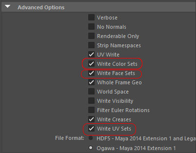
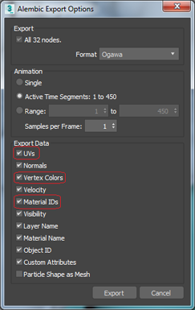

# Creating Alembic files in Autodesk® Digital Content Creation applications

## Creating Alembic files in Autodesk® Maya®

You can import Autodesk® Maya®'s shading group as a sub-Mesh. Before exporting to an Alembic file, enable the **Write Face Sets** option in Autodesk® Maya®, which is disabled by default.

The Alembic package also supports Autodesk® Maya®'s vertex color and multiple UV sets. Before exporting to an Alembic file, enable the **Write Color Sets** and **Write UV Sets** options in Autodesk® Maya®, both of which are disabled by default.

## Creating Alembic files in Autodesk® 3ds Max®

The Alembic package also supports Autodesk® 3ds Max®'s vertex colors and multiple UV sets. Before exporting to an Alembic file, enable the **UVs**, **Vertex Colors**, and **Material IDs** options under the **Export Data** section of Autodesk® 3ds Max® Alembic export settings. 

