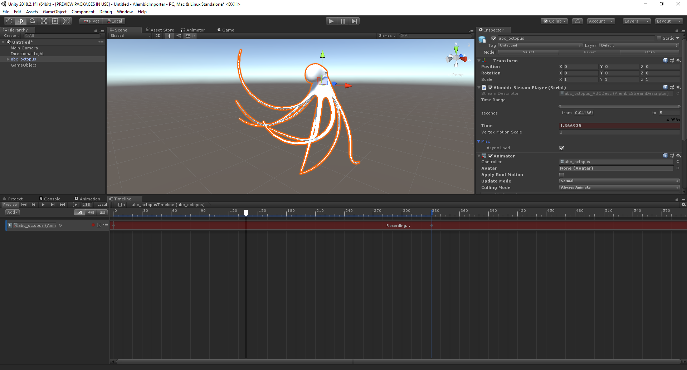

# Record and play back the Alembic using an Infinite clip

You can control the playback of Alembic using an **Infinite clip** on a Timeline **Animation Track** bound to the GameObject with the [Alembic Stream Player](ref_StreamPlayer.html) component. 

1. Select the GameObject with the Alembic Stream Player component and [open the Timeline window](https://docs.unity3d.com/Manual/TimelineEditorWindow.html).
2. [Create a Director component and a Timeline Asset](https://docs.unity3d.com/Manual/TimelineWorkflowCreatingAssetInstance.html) if you don't already have them. 
3. [Begin recording and save keys](https://docs.unity3d.com/Manual/TimelineWorkflowRecordingBasicAnimation.html) for the [**Time** property on the **Alembic Stream Player** component](ref_StreamPlayer.html). For example, if the Alembic file lasts 16 seconds, set a key at the beginning of the clip where the **Time** property is set to 0, and another key at the end of the clip where the **Time** property is set to 16.
4. Play back the animation using the [Timeline Play controls](https://docs.unity3d.com/Manual/TimelinePlaybackControls.html) in the Timeline window. 

If you want to use the animation in the GameObject's animation state machine, you can [convert the Infinite clip into an animation clip](https://docs.unity3d.com/Manual/TimelineWorkflowConvertingInfiniteClip.html) and add it to the [Animation Controller](https://docs.unity3d.com/Manual/Animator.html).

